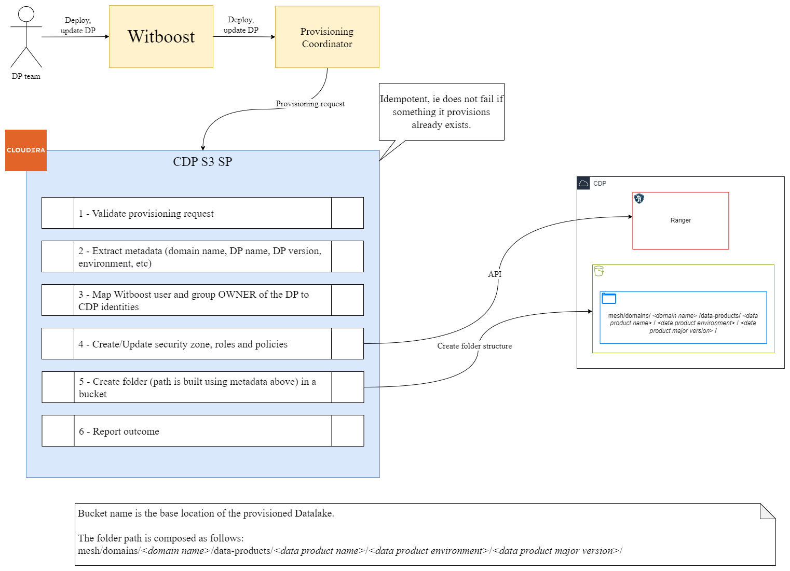
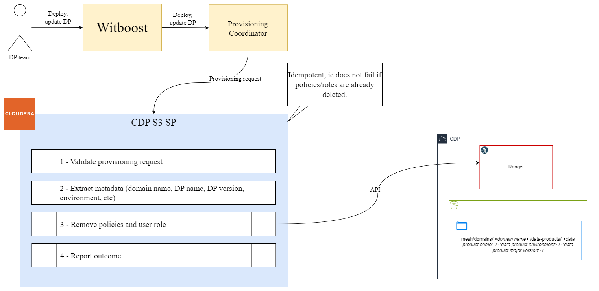

# High Level Design

This document describes the High Level Design of the CDP S3 Specific Provisioner.
The source diagrams can be found and edited in the [accompanying draw.io file](hld.drawio).

## Overview

### Specific Provisioner

A Specific Provisioner (SP) is a service in charge of performing a resource allocation task, usually
through a Cloud Provider. The resources to allocate are typically referred to as the _Component_, the
details of which are described in a YAML file, known as _Component Descriptor_.

The SP is invoked by an upstream service of the Witboost platform, namely the Coordinator, which is in charge of orchestrating the creation
of a complex infrastructure by coordinating several SPs in a single workflow. The SP receives
the _Data Product Descriptor_ as input with all the components (because it might need more context) plus the id of the component to provision, named _componentIdToProvision_

To enable the above orchestration a SP exposes an API made up of five main operations:
- validate: checks if the provided component descriptor is valid and reports any errors
- provision: allocates resources based on the previously validated descriptor; clients either receive an immediate response (synchronous) or a token to monitor the provisioning process (asynchronous)
- status: for asynchronous provisioning, provides the current status of a provisioning request using the provided token
- unprovision: destroys the resources previously allocated.
- updateacl: grants access to a specific component/resource to a list of users/groups

### CDP S3 Specific Provisioner

This Specific Provisioner interacts with a CDP Environment by creating a `folder` structure inside a `S3 Bucket`.

The folder path and name must be composed in a way to not interfere with other Data Products and/or other components of the same type in the same Data Product.

Appropriate permissions needs to be granted to the created folder.

CDP Public Cloud defaults to using cloud storage which might be challenging while managing data access across teams and individual users. The Ranger Authorization Service (RAZ) resolves this challenge by enabling Amazon S3 users to use fine-grained access policies and audit capabilities available in Apache Ranger similar to those used with HDFS files in an on-premises or IaaS deployment.

> Currently, there is no automated way to enable RAZ in an existing CDP environment that does not have RAZ enabled.

## Provisioning

Four main operations are executed on provisioning phase:
1. Request validation
2. Map of the Witboost identities to CDP identities
3. Security zone, roles (_OWNER_ and _USER_) and policies creation in Apache Ranger
4. Creation of the folder structure in the S3 bucket

## Unprovisioning

Unprovisioning consists of removing the existing _policies_ and _USER role_ in Apache Ranger.

## Update Acl

Three main operations are executed on this phase:
1. Request validation
2. Map of the Witboost identities requesting access to CDP identities
3. Add mapped users and groups to the _USER role_ in Apache Ranger (removing user and groups no more allowed to have access)

